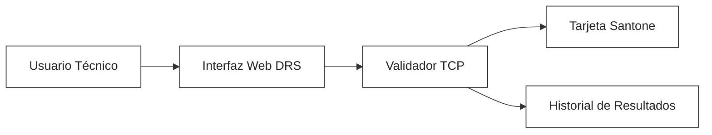

# Protocolo de Validación de Software DRS - Resumen Simple

## ¿Qué se hizo?
Se desarrolló un **validador de comandos TCP** para tarjetas Santone, que permite verificar si el software es compatible con el hardware. El sistema ejecuta lotes de comandos y muestra si la comunicación y las respuestas son correctas.

## Arquitectura (Mermaid)

## ¿Cómo me conecto en producción?
- Accede a la web: **http://192.168.60.140:8080**

## ¿Cómo pruebo?
1. Selecciona el dispositivo y lote de comandos
2. Ejecuta la validación desde la interfaz web
3. Observa los resultados en tiempo real y en el historial

## ¿Qué cosas se prueban?
- **Conectividad TCP** (¿el dispositivo responde?)
- **Comandos DRS** (lectura de parámetros, estado, etc.)
- **Compatibilidad de protocolo** (¿la respuesta es válida?)

## ¿Qué comandos se prueban?
El validador ejecuta comandos DRS para consultar los siguientes parámetros:
- **Estado Ethernet**: Verifica conectividad y configuración de red
- **Dirección IP**: Consulta la IP configurada en la tarjeta
- **Hostname**: Obtiene el nombre del dispositivo
- **Temperatura**: Lee el sensor de temperatura de la tarjeta
- **Voltaje y Corriente**: Consulta valores eléctricos
- **Estado de puertos**: Verifica el estado de los puertos RS485 y ópticos
- **Versión de firmware**: Consulta la versión instalada
- **Alarmas y eventos**: Lee registros de alarmas y eventos recientes
- **Otros parámetros de diagnóstico**: Según el modelo y configuración

Si todos estos comandos responden correctamente, se considera que el software es compatible y puede operar en producción.

## ¿Cómo se hacen las consultas?
Las consultas se realizan mediante el protocolo **TCP/IP** usando comandos DRS específicos para cada parámetro. El proceso es el siguiente:
- El validador abre una conexión TCP directa al puerto configurado en la tarjeta Santone (por defecto 65050).
- Envía comandos en formato compatible con el protocolo Santone (por ejemplo, secuencias hexadecimales tipo `7E...7E`).
- La tarjeta responde con datos codificados según el estándar DRS/Santone.
- El software interpreta la respuesta y la muestra en la interfaz web.

**Protocolos y tecnologías involucradas:**
- **TCP/IP**: Para la comunicación de red confiable
- **Protocolo Santone**: Estructura y codificación de comandos y respuestas
- **FastAPI + Python**: Backend del validador y API web
- **Docker**: Contenedor para despliegue y portabilidad

Este enfoque permite validar la compatibilidad real entre el software y el hardware, asegurando que los comandos y respuestas cumplen el estándar requerido.

## ¿Por qué es importante?
Si los comandos funcionan y las respuestas son correctas, **el software es compatible** con la tarjeta Santone y puede operar en producción.

## Estado actual
- ✅ Validación de comandos de lectura y estado
- ⚠️ Faltan comandos de seteo de parámetros (próxima fase)

---
*Este documento es un resumen simple para explicar el alcance y uso del validador DRS. Para detalles técnicos, consultar la documentación extendida.*
