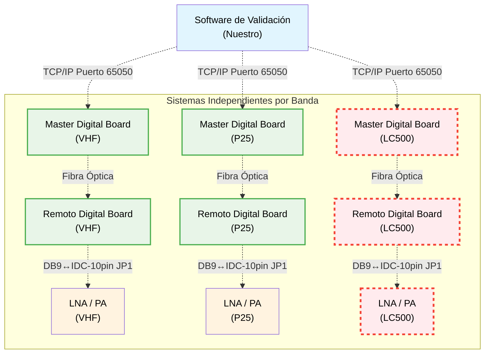
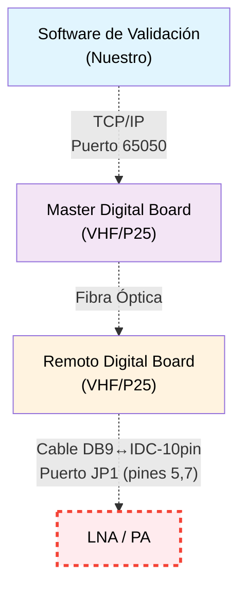
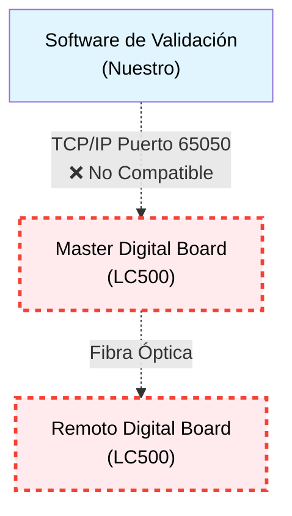
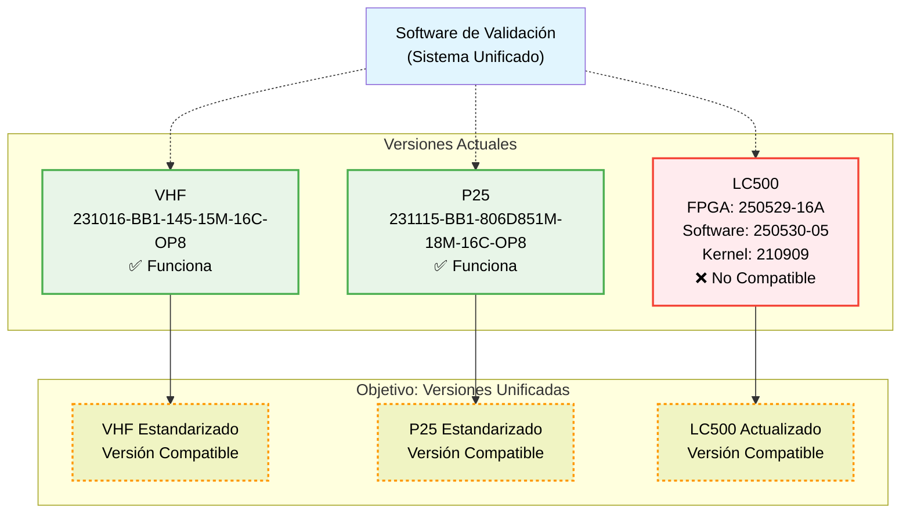

# Preguntas Técnicas: Conectividad Tarjetas Digitales VHF, P25 y LC500

## Contexto del Sistema

### Arquitectura

**NOTA**: Cada banda (VHF, P25, LC500) tiene su propio Master Digital Board y funciona como sistema independiente

### Versiones de Software
- **VHF**: 231016-BB1-145-15M-16C-OP8 ✅ Compatible TCP
- **P25**: 231115-BB1-806D851M-18M-16C-OP8 ✅ Compatible TCP  
- **LC500**: FPGA:250529-16A, Software:250530-05, Kernel:210909 ❌ No compatible TCP

### Componentes LNA/PA
- **Conexión**: Puerto JP1 pines 5,7 via cable DB9↔IDC-10pin
- **Problema**: Software nativo del remoto NO lee parámetros LNA/PA
- **Objetivo**: Monitoreo integrado via TCP/IP

---

## Preguntas Técnicas

### 1. Monitoreo LNA/PA

**Arquitectura del Problema:**

**PROBLEMA**: Software nativo del remoto NO lee parámetros LNA/PA  
**OBJETIVO**: Monitoreo integrado via TCP/IP

**Preguntas:**
- ¿Existen comandos específicos en "Protocol _TT_2023_8_30.pdf" para LNA y PA?
- ¿Se puede usar puerto 65050 para monitorear LNA/PA?
- ¿Por qué el software nativo del remoto no lee parámetros LNA via DB9-IDC 10pin?
- ¿Es posible transportar comandos LNA/PA a través de: Master → Fibra → Remoto → TCP/IP?
- ¿Se requiere configuración especial en master/remoto para habilitar comunicación LNA/PA?
- ¿Los archivos .rar VHF/P25 incluyen comandos de monitoreo para LNA/PA?

### 2. Compatibilidad LC500

**Arquitectura del Problema:**

**PROBLEMA**: LC500 no soporta protocolo TCP Puerto 65050  
**OBJETIVO**: Hacer LC500 compatible con sistema de monitoreo

**Preguntas:**
- ¿LC500 soporta los mismos comandos TCP que VHF/P25 via fibra óptica?
- ¿Es compatible con puerto 65050 en master digital board?
- ¿Qué modificaciones requiere LC500 para compatibilidad TCP?
- ¿Hay que actualizar LC500 a versiones compatibles con VHF/P25?

### 3. Estandarización

**Arquitectura de Versiones:**

**PROBLEMA**: Diferentes versiones complican mantenimiento y compatibilidad  
**OBJETIVO**: Estandarizar versiones para monitoreo unificado

**Preguntas:**
- ¿Es posible usar las mismas versiones VHF/P25 en todas las tarjetas?
- ¿Mejoraría esto la compatibilidad del monitoreo TCP?
- ¿Hay implicaciones técnicas en estandarizar versiones?

## Comandos de Monitoreo Requeridos (13 comandos TCP)
- `temperature` (0x02), `device_id` (0x97), `datt` (0x09)
- `input_and_output_power` (0xF3), `channel_switch` (0x42)
- `channel_frequency_configuration` (0x36), `central_frequency_point` (0xEB)
- `subband_bandwidth` (0xED), `broadband_switching` (0x81)
- `optical_port_switch` (0x91), `optical_port_status` (0x9A)
- `optical_port_devices_connected_1` (0xF8), `optical_port_devices_connected_2` (0xF9)

## Archivos de Referencia
- `Protocol _TT_2023_8_30.pdf` ✅ Protocolo principal (funciona)
- `Santone module monitor protocol_2023_8_15.pdf` ❌ No funciona
- `VHF - 231016-BB1-145-15M-16C-OP8.rar`, `P25 - 231115-BB1-806D851M-18M-16C-OP8.rar`
- `LNA_VHF_Technical Specification (1).pdf`

---
*Versión: 2.2 - Diagramas Mermaid por pregunta*</content>
<parameter name="filePath">/home/arturo/sw-drsmonitoring/validation-framework/docs/preguntas_conectividad_tarjetas_digitales.md